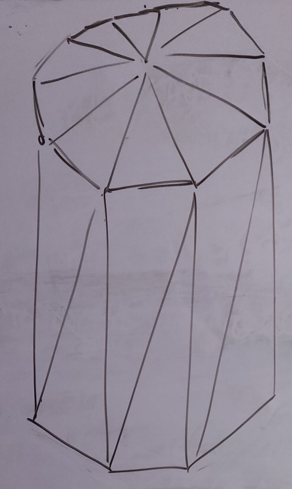
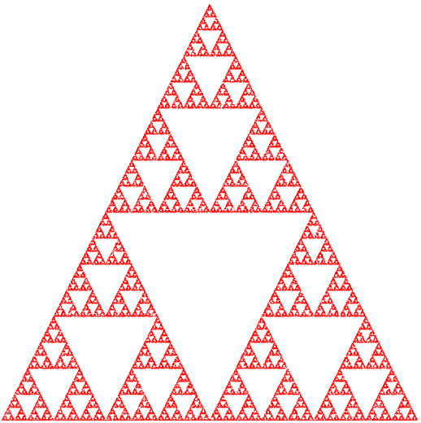

---
geometry: margin=20mm
urlcolor: blue
header-includes: |
    \usepackage{fancyhdr}
    \pagestyle{fancy}
    \lhead{Jaan Jaerving}
    \chead{}
    \rhead{TÖL203M, Heimadæmi 1}
...

## 1. OpenGL (og WebGL) geta aðeins teiknað þríhyrninga.  Útskýrið hvernig hægt væri að skilgreina fylltan sívalning eingöngu með þríhyrningum í þrívíðu rúmi. Rissið upp mynd af sívalningi og útskýrið hvernig hann væri myndaður úr þríhyrningum. Til að fá nokkuð góða nálgun á sívalningi hversu marga þríhyrninga haldið þið að þurfi (bara stærðargráður: tugi, hundruð, þúsundir, ...)? Rökstyðjið í nokkrum orðum.

\

Í grófum dráttum:

{ height=50% }

Það myndi byrja að vera aðeins meira sannfærandi á stærðargráðu hundruð en tæknilega séð er hægt að auka "gæðið" endalaust, það er aldrei hægt að fá fullkomna nálgun á hring með því að nota beinar línur.

\pagebreak

## 2. Kynnið ykkur eitt af öflugustu grafíkkortunum fyrir borðtölvur í dag [Nvidia GeForce RTX 3090](https://www.nvidia.com/en-eu/geforce/graphics-cards/30-series/rtx-3090/) (aðeins ítarlegri upplýsingar á [Wikipedia](https://en.wikipedia.org/wiki/GeForce_30_series)) og finnið út eftifarandi gildi:

\

### a. Innri bandvídd (memory bandwidth), þ.e. flutninghraði milli grafíkminnis og GPU

936.2 GB/s

\

### b. Litahraði skjápunkta (pixel fill rate), þ.e. hversu marga skjápunkta er hægt að lita á sek.

162.7 GP/s

\

### c. Ytri bandvídd (bus interface bandwidth), þ.e. bandvídd tengibrautar (PCI-e 4.0, sjá t.d. [hér](https://en.wikipedia.org/wiki/PCI_Express))

PCI-e x16: 31.5 GB/s

\

### d. Hámarks skjáupplausn (max digital resolution) og hvaða sjónvarps/skjá staðall er það?

7680x4320 eða 8K

HDMI $\geq$ 2.1

Displayport $\geq$ 1.4

\pagebreak

## 3. Skoðið aðeins nýja grafíkforritasafnið [Vulkan](https://www.vulkan.org/) og nefnið helstu kosti þess umfram OpenGL (sjá t.d. líka á [Wikipedia](https://en.wikipedia.org/wiki/Vulkan)).  Þetta eiga bara að vera 3-5 setningar, ekki ritgerð!

\

Fótspor fyrir rekla sem Vulkan notar er talsvert minni, einnig er hægt að sameina vinnslu með því að nota batching og það er auðveldar að nota margar þræðir ( enda var OpenGL lengi hannaður til að keyra á einu kjarna. ) Allt þetta þýðir að við getum notað örgjörvan á mun hagkvæmari hátt. Annað sem er í boði er að ganga frá því að byggja litarar fyrirfram - aðferð sem er í mikilli notkun t.d. á Steam ( Linux. ) Að lokum er hægt að stjórna minnið beint, eitthvað sem var ekki í boði fyrir OpenGL.

\pagebreak

## 4. [Khronos samtökin](https://www.khronos.org/) halda utanum ýmsa fleiri opna staðla sem tengjast grafík og grafíkörgjörvum.  Skoðið aðeins staðlana [glTF](https://www.khronos.org/gltf/) og [OpenXR](https://www.khronos.org/openxr/) og segið stuttlega í ykkar eigin orðum frá tilgangi þeirra.

\

* glTF: Staðall sem skilgreinir skráarkerfi sem er hægt að nota til að geyma 3D módelum. Hægt er að geyma ýmsar upplýsingar eins og t.d. örvun (e. animation.) glTF staðallinn er í notkun hjá stórfyrirtækjum eins og Microsoft.

* OpenXR: Staðall sem skilgreinir hvernig á að byggja eða tengja vél (e. engine) með tæki sem styður sýndarveruleika (VR en einnig AR.) T.d. er hægt að nota OpenXR staðallinn til að nálgast sýndurveruleika m.a. með Unity og Unreal til að forrita tölvuleikir.

\pagebreak

## 5. Náið í [útgáfu 1](https://www.cs.unm.edu/~angel/BOOK/INTERACTIVE_COMPUTER_GRAPHICS/SEVENTH_EDITION/CODE/02/gasket1.html) af þéttilista Sierpinskis og fáið hana til að virka á tölvunni hjá ykkur. Þið þurfið einnig að ná í Javascript skránna ([gasket1.js](https://www.cs.unm.edu/~angel/BOOK/INTERACTIVE_COMPUTER_GRAPHICS/SEVENTH_EDITION/CODE/02/gasket1.js)) og skrárnar **webgl-utils.js**, **initShaders.js** og **MV.js** sem eru í möppunni [Common](https://www.cs.unm.edu/~angel/BOOK/INTERACTIVE_COMPUTER_GRAPHICS/SEVENTH_EDITION/CODE/Common/).  Fjölgið punktunum sem eru teiknaðir svo að myndin verði skarpari.  Skilið mynd af útkomunni.

\

Fyrir `var NumPoints = 50000` í `gasket1.js`

{ height=50% }

