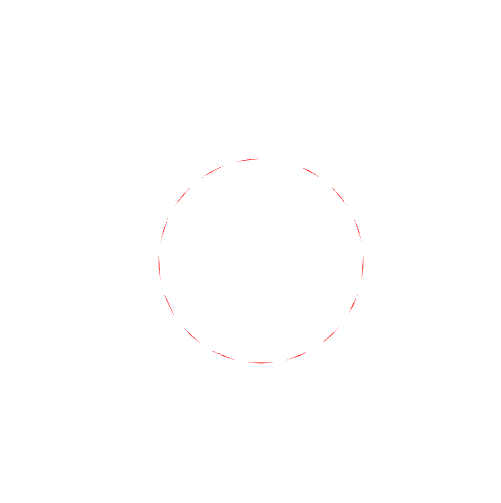

---
geometry: margin=20mm
urlcolor: blue
header-includes: |
    \usepackage{fancyhdr}
    \pagestyle{fancy}
    \lhead{Jaan Jaerving}
    \chead{}
    \rhead{TÖL203M, Heimadæmi 2}
...

## 1. Breytið sýniforritinu [gasket1](https://www.cs.unm.edu/~angel/BOOK/INTERACTIVE_COMPUTER_GRAPHICS/SEVENTH_EDITION/CODE/02/gasket1.html) á heimasíðu kennslubókarinnar á eftirfarandi vegu (hvor breyting er sjálfstæð):

### a. Í stað þess að fyrsti punkturinn sé í miðju þríhyrningsins, látið hann vera vel fyrir utan þríhyrninginn, t.d. í (100, 100).  Skilið mynd af útkomunni og hlekk á forritið.

[Hlekkur (1. a)](https://anjrv.github.io/hw2/a/2D%20Sierpinski%20Gasket.html)

\pagebreak

### b. Látið einn hornpunktanna vera mun líklegri til að vera valinn er hina tvo punktana, þannig að hornpunktur 0 sé valinn í 90% (18 af 20 skiptum), en hinir tveir í 5% (1 af 20 skiptum) hvor.  Hér eruð þið að velja gildið á breytunni j inni í for-lykkjunni.  Skilið skjámynd og hlekk á forritið

[Hlekkur (1. b)](https://anjrv.github.io/hw2/b/2D%20Sierpinski%20Gasket.html)

\pagebreak

## 2. Hér er gefið WebGL forrit ([circlefan.html](https://hjalmtyr.github.io/WebGL-forrit/Angel/circlefan.html) og [circlefan.js](https://hjalmtyr.github.io/WebGL-forrit/Angel/circlefan.js)) sem teiknar fyllta rauða hringskífu. Skífan er nálguð með því að reikna út ákveðinn fjölda hnúta á hringnum og teikna þá (ásamt miðpunktinum) sem TRIANGLE_FAN í drawArrays-fallinu.  Breytið þessu forritið þannig að hringurinn sé teiknaður sem TRIANGLES í drawArrays.  Það þýðir að hverjir þrír punktar eru túlkaðir sem þríhyringur.  Þið þurfið því að bæta við punktum í vigurinn sem sendur er yfir til grafíkkortsins. Setjið forritið á vefsvæði og skilið hlekk á það.

[Hlekkur](https://anjrv.github.io/hw2/2/circlefan.html)

\pagebreak

## 3. Á heimasíðu kennslubókarinnar er sýniforritið [gasket5](https://www.cs.unm.edu/~angel/BOOK/INTERACTIVE_COMPUTER_GRAPHICS/SEVENTH_EDITION/CODE/02/gasket5.html). Það notar sleða (slider) til að breyta fjölda uppskiptinga á endurkvæma þríhyrningi Sierpinskis.  Notið það forrit sem fyrirmynd þegar þið breytið forritinu [circlefan](https://hjalmtyr.github.io/WebGL-forrit/Angel/circlefan.html) (úr dæmi 2), þannig að notandinn geti valið með sleða hversu margir punktar eiga að vera á hringskífunni (þ.e. hversu góð nálgunin er), allt frá 4 til 100.  Skilið skjámynd og hlekk á forritið.

[Hlekkur](https://anjrv.github.io/hw2/3/circlefan.html)

\pagebreak

## 4. Hér er WebGL forrit ([7-shape-fan.html](https://hjalmtyr.github.io/WebGL-forrit/Angel/7-shape-fan.html) og [7-shape-fan.js](https://hjalmtyr.github.io/WebGL-forrit/Angel/7-shape-fan.js)) sem notar TRIANGLE_FAN til að teikna tölustafinn 7.  Skrifið nýja útgáfu af forritunu sem notar TRIANGLE_STRIP til að teikna sömu mynd.  Athugið að þið gætuð þurft að hugsa röð hnútanna uppá nýtt og jafnvel að endurtaka einhverja hnúta.  Skilið skjámynd og hlekk á forritið ykkar.

[Hlekkur](https://anjrv.github.io/hw2/4/7-shape-fan.html)

\pagebreak

## 5. Skrárnar [points.html](https://hjalmtyr.github.io/WebGL-forrit/Angel/points.html) og [points.js](https://hjalmtyr.github.io/WebGL-forrit/Angel/points.js) útfæra WebGL forrit sem leyfir notanda að búa til punkta á striganum (canvas).  Punktastærðin er sett í hnútalitaranum í HTML-skránni.  Hún er sett sem 5.0 til að auðveldara sé að sjá punktana.  Þið eigið að skrifa forritið triangles, þar sem við hvern músarsmell er teiknaður lítill þríhyrningur með miðju í skjápunktinum sem smellt var á.  Athugið að þið þurfið að búa til þrjá punkta fyrir hvern smell.  Látið einnig hægri músarsmell hreinsa strigann og eyða öllum þríhyrningunum.  Skilið sjámynd og hlekk á forritið ykkar.

[Hlekkur](https://anjrv.github.io/hw2/5/points.html)

