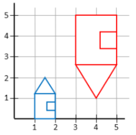

---
geometry: margin=20mm
urlcolor: blue
header-includes: |
    \usepackage{fancyhdr}
    \pagestyle{fancy}
    \lhead{Jaan Jaerving}
    \chead{}
    \rhead{TÖL203M, Heimadæmi 3}
...

## 1. Við höfum 2-víða vigurinn w sem eru táknaður við grunnvigrana v1 = [2, 1] og v2 = [-1, 2]. Táknun w við grunnvigrana tvo er a = [3, 1].  Hver væri táknun w við grunnvigrana [1, 0] og [0, 1]?

\
Fyrir vector space v1 = [1, 0] og v2 = [0, 1] væri w = [1, 1]

\pagebreak

## 2. Sýnið (með því að margfalda upp úr vörpunarfylkjunum) hvort eftirfarandi tvívíðar varpanir eru víxlnar (commutative):

### a. Tveir snúningar, þ.e. er $R(\theta) \cdot R(\phi) = R(\phi) \cdot R(\theta)$?

**Ekki víxlun**
\
$$
\begin{bmatrix}
\cos(90) & -\sin(90) & 0 \\
\sin(90) & \cos(90) & 0 \\
0 & 0 & 1
\end{bmatrix}
\cdot
\begin{bmatrix}
\cos(270) & -\sin(270) & 0 \\
\sin(270) & \cos(270) & 0 \\
0 & 0 & 1
\end{bmatrix}
=
\begin{bmatrix}
0 & -1 & 0 \\
0 & 1 & 0 \\
0 & 0 & 1
\end{bmatrix}
$$
$$
\neq
$$
$$
\begin{bmatrix}
\cos(270) & -\sin(270) & 0 \\
\sin(270) & \cos(270) & 0 \\
0 & 0 & 1
\end{bmatrix}
\cdot
\begin{bmatrix}
\cos(90) & -\sin(90) & 0 \\
\sin(90) & \cos(90) & 0 \\
0 & 0 & 1
\end{bmatrix}
=
\begin{bmatrix}
0 & 1 & 0 \\
0 & 1 & 0 \\
0 & 0 & 1
\end{bmatrix}
$$

\

### b. Tvær hliðranir, þ.e. er $T(a,b) \cdot T(c,d) = T(c,d) \cdot T(a,b)$?

**Ekki víxlun**
\
$$
\begin{bmatrix}
1 & 0 & 2 \\
0 & 1 & 3 \\
0 & 0 & 1
\end{bmatrix}
\cdot
\begin{bmatrix}
1 & 0 & 4 \\
0 & 1 & 5 \\
0 & 0 & 1
\end{bmatrix}
=
\begin{bmatrix}
1 & 0 & 6 \\
0 & 1 & 8 \\
0 & 0 & 1
\end{bmatrix}
$$
$$
\neq
$$
$$
\begin{bmatrix}
1 & 0 & 4 \\
0 & 1 & 5 \\
0 & 0 & 1
\end{bmatrix}
\cdot
\begin{bmatrix}
1 & 0 & 2 \\
0 & 1 & 3 \\
0 & 0 & 1
\end{bmatrix}
=
\begin{bmatrix}
1 & 0 & 2 \\
0 & 1 & 3 \\
0 & 0 & 1
\end{bmatrix}
$$

\

### c. Sńuningur og jöfn kvörðun, þ.e. er $R(\theta) \cdot S(a,a) = S(a,a) \cdot R(\theta)$?

**Víxlun**
\
$$
\begin{bmatrix}
\cos(90) & -\sin(90) & 0 \\
\sin(90) & \cos(90) & 0 \\
0 & 0 & 1
\end{bmatrix}
\cdot
\begin{bmatrix}
2 & 0 & 0 \\
0 & 2 & 0 \\
0 & 0 & 1
\end{bmatrix}
=
\begin{bmatrix}
0 & -2 & 0 \\
2 & 0 & 0 \\
0 & 0 & 1
\end{bmatrix}
$$
$$
=
$$
$$
\begin{bmatrix}
2 & 0 & 0 \\
0 & 2 & 0 \\
0 & 0 & 1
\end{bmatrix}
\cdot
\begin{bmatrix}
\cos(90) & -\sin(90) & 0 \\
\sin(90) & \cos(90) & 0 \\
0 & 0 & 1
\end{bmatrix}
=
\begin{bmatrix}
0 & -2 & 0 \\
2 & 0 & 0 \\
0 & 0 & 1
\end{bmatrix}
$$

\pagebreak

## 3. Hér fyrir neðan er tvívítt vörpunarfylki í jafnþættum (homogeneous) hnitum:

$$
\begin{bmatrix}
0 & 1 & 0 \\
1 & 0 & 0 \\
0 & 0 & 1
\end{bmatrix}
$$

\

### a. Útskýrið í orðum hvað vörpunin gerir, þ.e. hvaða áhrif hún hefur á tvívíðan hlut sem er varpað með henni

Þetta væri speglun á X-ás og 90 gráða rangsælissnúningur um núllpunkt.

### b. Táknið vörpunina að ofan sem samsetningu grunnvarpana, þ.e. hliðrun (translate), kvörðun (scaling) og snúning (rotation).

$$S(-1, 1) \cdot R(90)$$
$$
=
$$
$$
\begin{bmatrix}
-1 & 0 & 0 \\
0 & 1 & 0 \\
0 & 0 & 1
\end{bmatrix}
\cdot
\begin{bmatrix}
\cos(90) & -\sin(90) & 0 \\
\sin(90) & \cos(90) & 0 \\
0 & 0 & 1
\end{bmatrix}
=
\begin{bmatrix}
0 & 1 & 0 \\
1 & 0 & 0 \\
0 & 0 & 1
\end{bmatrix}
$$

\pagebreak

## 4. [Próf 2021]  Eftir mikið partí er húsið okkar alveg á hvolfi (rautt).  Færið húsið í upphaflega stöðu (blátt) með samsettri tvívíðri vörpun.  Sýnið einstök skref og rökstyðjið þau.

Byrjum með fylki fyrir kvörðun og speglun. Sjáum að breiddin hefur stækkað 2x. Virðist vera að hæðin hefur einnig stækkað um 2x ( veggurinn í u.þ.b. 1.25 fyrir bláa og 2.5 fyrir rauða. ) Getum þá minnkað með því að kvarða með 0.5. Sjáum einnig að glugginn er reyndar á réttri hlið, getum þá sparað okkur snúning með því að spegla y-ásinn.

$$
\begin{bmatrix}
0.5 & 0 & 0 \\
0 & -0.5 & 0 \\
0 & 0 & 1
\end{bmatrix}
$$

Nú ætti útlit að vera nokkuð veginn rétt en þurfum að hliðra til að fá rétta staðsetningu. Vegna þess að við vorum að kvarða með -0.5 á y-ásinn er þakið núna í -0.5. Þúrfum þá að hliðra upp á y-ásinn um 2.5. Vinstri veggurinn væri núna í 3 * 0.5 = 1.5 og þurfum þá að hliðra -0.5 á x-ásinn.

$$
\begin{bmatrix}
1 & 0 & -0.5 \\
0 & 1 & 2.5 \\
0 & 0 & 1
\end{bmatrix}
$$

Samsett væri þetta þá:

$$
\begin{bmatrix}
0.5 & 0 & -0.25 \\
0 & -0.5 & -1.25 \\
0 & 0 & 1
\end{bmatrix}
$$

\pagebreak

## 5. Breytið sýnisforritinu [box-bounce](https://hjalmtyr.github.io/WebGL-forrit/Angel/box-bounce.html) þannig að vinstri og hægri örvalyklarnir breyta stefnu "boltans" til vinstri og hægri.  Ef slegið er á vinstri örvalykil þá fer hann að færast aðeins meira til vinstri (lækka dX).  Sambærilegt gildir ef slegið er á hægri örvalykil.  Breytið svo virkni upp og niður örvalyklanna þannig að upp-örin stækkar boltann, en niður-örin minnkar hann (boxRad).

[Hlekkur](https://anjrv.github.io/hw3/box-bounce.html)
