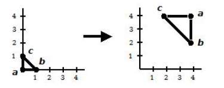
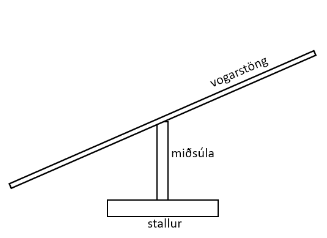

---
geometry: margin=20mm
urlcolor: blue
header-includes: |
    \usepackage{fancyhdr}
    \pagestyle{fancy}
    \lhead{Jaan Jaerving}
    \chead{}
    \rhead{TÖL203M, Heimadæmi 4}
...

## 1. [Gamalt prófdæmi] Hér fyrir neðan er tvívíða þríhyrningnum með hornpunkta (0,0), (1,0) og (0,1) varpað yfir í þríhyrninginn með hornpunkta (4,4), 4,2) og (2,4).  Athugið að röð hornpunktanna skiptir máli.  Sýnið samsetta vörpun sem framkvæmir þessa breytingu. Ekki þarf að sýna fylkin sjálf, en rökstyðjið hvern lið í samsettu vörpuninni.

\

* Byrjum á því að stilla stærðina og speglum á y-ásinn til að skipta um röðun fyrir C og B. $S(2, -2)$
* Snúum svo til að færa hornpunktana yfir á réttan form. $R(270)$
* Kvörðum síðast til að færa hnutana yfir á réttan stað. $T(4, 4)$
* **Vörpun er þá $M = T(4,4) R(270) S(2, -2)$**

\pagebreak

## 2. [Byggt á gömlu prófdæmi] Gefinn er þrívíður teningur með gagnstæð horn í (-4, -1, 2) og (-1, 2, -1). Það á að breyta honum í einingartening með miðju á sama stað og upphaflegi teningurinn og honum hefur verið snúið um $\theta$ gráður rangsælis um y ás. Sýnið samsettu vörpununina sem útfærir þessa breytingu á teningnum og útskýrið einstakar varpanir í henni. Það þarf ekki að gefa upp fylkin sjálf, heldur bara nefna hverja vörpun og gildin í henni.
\

* Viljum halda miðju á sama stað, skilgreinum miðjupúnkt $p = [-2.5, 0.5, 0.5]$
* Getum þá hliðrað niður í núllpunkt $T(-p)$
* Breytum stærðina til að fá einingartening $S(\frac{1}{3},\frac{1}{3},\frac{1}{3})$
* Framkvæmum rangsælis snúningu $R_{y}(\theta)$
* Hliðrum til baka $T(p)$
* **Erum þá með $M = T(p) R_{y}(\theta) S(\frac{1}{3},\frac{1}{3},\frac{1}{3}) T(-p)$**

\pagebreak

## 3. Skrifið WebGL forrit sem býr til tölvuskjá.  Í okkar útgáfu af tölvuskjá er hann samsettur úr þremur teningum.  Það er skjárinn sjálfur, sem er flatur og breiður "teningur", síðan er standurinn samsettur úr tveimur teningur.  Annar þeirra er nokkur flatur og liggur á jörðinni, en hinn er eins og þykk stöng sem tengir botninn við skjáinn sjálfan.  Annars treysti ég því að þið vitið hvernig tölvuskjár lítur út!  Notandinn á að geta snúið skjánum í hringi með músinni (svipað og í [letterH](https://hjalmtyr.github.io/WebGL-forrit/Angel/letterH.html)).  Skilið skjámynd og hlekk á forritið ykkar.

\pagebreak

## 4. [Byggt á prófdæmi frá 2021] Leiktækið snúningsvegasalt er eins og venjulegt vegasalt (seesaw), nema að það getur líka snúist í hringi (þ.e. 360° um miðjuna).  Þið eigið að skrifa forrit fyrir þrívíðri útfærslu á slíku leiktæki.  Hjá okkur samanstendur það af þremur einingum: flatur stallur sem situr á jörðinni og veitir stöðuleika, miðsúla, sem stendur uppúr stallinum, og loks vogarstöng, sem situr ofaná miðsúlunni.  Endar vogarstangarinnar geta farið upp og niður eins og í venjulegu vegasalti, en svo getur hún líka snúist um miðju sína (sem situr ofan á miðsúlunni). WebGL forritið ykkar á að láta útbúa þetta leiktæki og að láta það vera á hreyfingu, þ.e. vega salt og snúast á sama tíma.  Skilið skjáskoti og hlekk á forritið ykkar.

\pagebreak

## 5. Hér sýnisforritið [solkerfi-tungl](https://hjalmtyr.github.io/WebGL-forrit/Angel/solkerfi-tungl.html) sem hermir sólin, jörðina og tunglið.  Þið eigið að bæta við gervihnetti sem snýst um tunglið.  Tunglið snýst um jörðina í sama fleti og jörðin snýst um sóluna, en gervihnötturinn fer yfir póla tunglsins og hallar því 90° miðað við hinar sporbrautirnar.  Bætið einnig við þeim eiginleika að upp/niður örvalyklarnir auka/minnka hraða hermunarinnar.  Skilið skjáskoti og hlekk á forritið ykkar.

