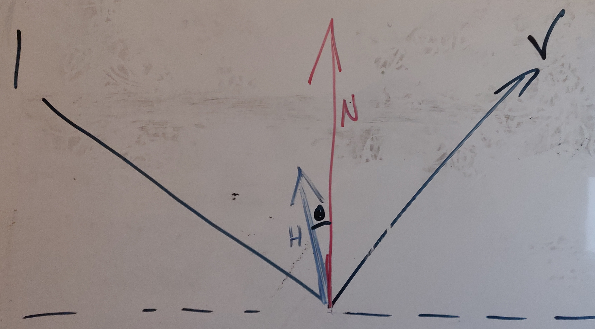
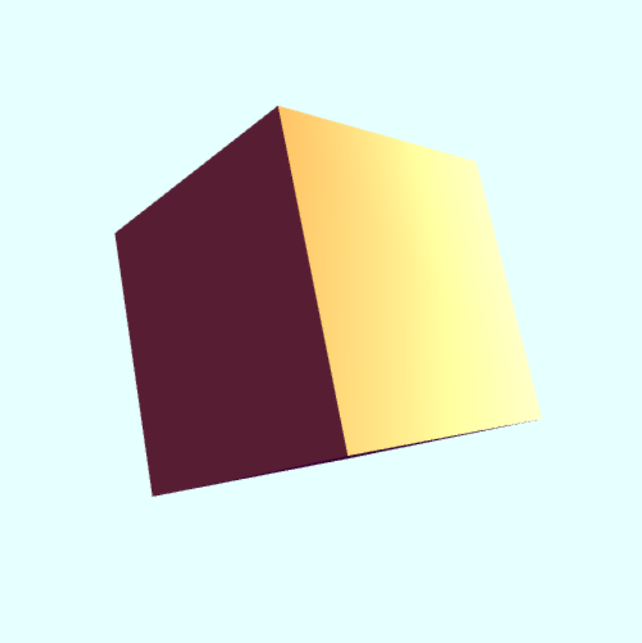

---
geometry: margin=20mm
urlcolor: blue
header-includes: |
    \usepackage{fancyhdr}
    \pagestyle{fancy}
    \lhead{Jaan Jaerving}
    \chead{}
    \rhead{TÖL203M, Heimadæmi 6}
...

## 1. [Gamalt prófdæmi] Yfirborð er lýst með lýsingarlíkani Blinn-Phong:

$${\it l} = k_{a}L_{a} + k_{d}L_{d}max(({\bf l \cdot n}, 0) + k_{s}L_{s}max(({\bf n \cdot h})^{\alpha}, 0)$$

## Ef gefin er stefna ljósgjafa (l) og stefna áhorfanda (v) í punkti P, hver ætti þá að vera stefna þvervigursins (n) í P til þess að:

### a. hámarka gildi dreifendurskinsins (diffuse) sem áhorfandinn sér?

Dreifendurskin er með sömu gildi í allar áttir, það þarf bara að vera sýnilegur.

### b. hámarka gildi depilendurskinsins (specular) sem áhorfandinn sér?

Breytingin sem við gerum fyrir Blinn-Phong er að nota vigur *h* sem er mitt á milli *l* og *v*. Hámarks depilendurskin gerist ef stefnur á *n* og *h* eru þær sömu, eða þá lágmarka hornið milli þeirra.




\pagebreak

## 2. [Gamalt prófdæmi]  Tiltekið líkan er táknað með þríhyrningagrind.  Því miður snúa nokkrir þríhyrningarnir öfugt, þ.e. hnútar þeirra eru taldir upp í réttsælisröð, en hnútar allra annara þríhyrninga í líkaninu eru taldir upp í rangsælisröð.

### a. Ef líkanið er lýst með endurskinslíkani Phong, hvernig birtast þá þessir "öfugu" þríhyrningar?

Þessar þrírhyrningar fá þá bara umhverfislitinn sem fer á öll yfirborð. Dreif- og depilendurskin verður ekki reiknaður nema ef við snúum þvervigrunum við.

### b. Skiptir máli hvort við höfum kveikt á bakhliðareyðingu?  Ef svo hvað gerist þá?

Þessar þríhyrningar verða þá ekki teiknaðar.


\pagebreak

## 3. Skrifið forritið _PhongCube_ sem sýnir tening sem er lýstur með lýsingarlíkani Phong (eða Blinn-Phong) og litaður með Phong litun.  Það ætti að vera hægt að snúa teningnum með músinni og það ætti að koma depill á hlið teningsins.  Þið getið notað fallið colorCube úr sýniforritinu [cube-color.html](https://hjalmtyr.github.io/WebGL-forrit/Angel/cube-color.html), nema í stað litagildis í hverjum hnúti setjið þið þvervigur hnútsins (getið reiknað hann á svipaðan hátt og gert er í fallinu triangle í sýniforritinu [FlotKula.html](https://hjalmtyr.github.io/WebGL-forrit/Angel/FlotKula.html)).

[Hlekkur](https://anjrv.github.io/hw6/PhongCube.html)




\pagebreak

## 4. Skoðið sýniforritið [TransparentTepottur](https://hjalmtyr.github.io/WebGL-forrit/Angel/TransparentTepottur.html). Þið eigið að breyta því á tvo vegu:

### i. Þegar notandinn ýtir á niður-örina þá þá minnkar talan sem stýrir því hvort búti sé hent (discard).  Þetta þýðir að fleiri bútum verður hent og stærra yfirborð tepottsins verða gegnsætt.  Þegar ýtt er á upp-örina þá hækkar talan.  Athugið að talan getur aðeins tekið gildi á bilinu 0.0 til 4.0.

### ii. Þegar notandinn ýtir á vinstri/hægri örina þá breytist liturinn á tepottinum (þ.e. dreifliturinn).  Það er hægt að útfæra þetta með því að vera með heiltölu frá 0 til 999 og breyta svo þessari 3ja stafa heiltölu yfir í RGB lit, með hvern grunnlit með gildi frá 0.1 til 1.0 (t.d. heiltalan 724 verður (0.8, 0.3, 0.5).  Vinstri ör lækkar heiltöluna um 1, en hægri ör hækkar hana.

[Hlekkur](https://anjrv.github.io/hw6/TransparentTepottur.html)

```js
var rgb = 777;

window.addEventListener('keydown', function (e) {
  switch (e.keyCode) {
    case 37:
      rgb = rgb > 100 ? rgb - 1 : rgb;
      var tmp = vec4(Number(String(rgb)[0]) / 10 + 1,
      Number(String(rgb)[1]) / 10 + 1,
      Number(String(rgb)[2]) / 10 + 1, 1.0);
      gl.uniform4fv(
        gl.getUniformLocation(program, 'diffuseProduct'),
        flatten(tmp),
      );
      break;
    case 39:
      rgb = rgb < 999 ? rgb + 1 : rgb;
      var tmp = vec4(Number(String(rgb)[0]) / 10 + 1,
      Number(String(rgb)[1]) / 10 + 1,
      Number(String(rgb)[2]) / 10 + 1, 1.0);
      gl.uniform4fv(
        gl.getUniformLocation(program, 'diffuseProduct'),
        flatten(tmp),
      );
      break;
    case 38:
      discardPriority += discardPriority < 4.0 ? 0.1 : 0.0;
      break;
    case 40:
      discardPriority -= discardPriority > 0.0 ? 0.1 : 0.0;
      break;
  }
});
...
gl.uniform1f(gl.getUniformLocation(program, 'discardPrio'), discardPriority);
```

\pagebreak

## 5. Ytra geymsluform stafrænna mynda er lang oftast á þjöppuðu formi, annað hvort taplaus (*lossless*) eða tapandi (*lossy*) þjöppun.  Innra formið er hins vegar alltaf á hrátt (*raw*), án þjöppunar og kóðunar.

### a. Hvers vegna er hagkvæmara að geyma myndir á þjöppuðu formi á ytri geymslumiðlum frekar en í innra minni?

Það að geyma myndir á þjöppuðu formi á ytri geymslumiðlum gefur okkur tækifæri til að hlaða hraðar inn í innra minni og minnkar einnig hvað við notum mikið af geymslupláss þegar myndirnar eru ekki í notkun.

### b. Gætum við geymt myndir í innra minni tölvunnar á þjöppuðu formi?  Hvaða kosti og galla hefði það í för með sér?

Við getum gert það og það myndi minnka minnisnotkun. Hinsvegar erum við þá að missa gæði þegar við erum að teikna myndir á þjöppuðu formi.

