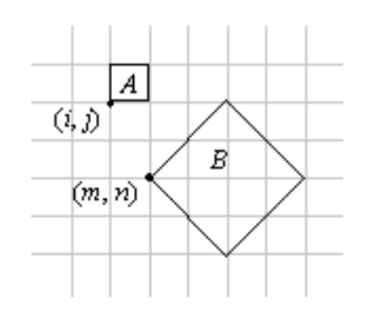
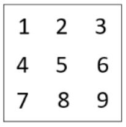
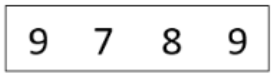
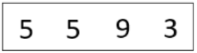

---
geometry: margin=20mm
urlcolor: blue
header-includes: |
    \usepackage{fancyhdr}
    \pagestyle{fancy}
    \lhead{Jaan Jaerving}
    \chead{}
    \rhead{TÖL203M, Heimadæmi 7}
...

## 1. [Úr eldra efni, gamalt prófdæmi]  Sýnið samsetta tvívíða vörpun sem breytir ferningnum A yfir í B.  Punkturinn (i, j) í A á að varpast í punktinn (m, n) í B.  Athugið að við vitum ekki sambandið á milli (i, j) og (m, n) (þ.e. fjarlægðina á milli ferninganna), en hins vegar er stærðarmunur ferningnanna sá sem myndin sýnir.  Þið þurfið ekki að sýna fylkin sjálf, en þið þurfið að rökstyðja hvern þátt í samsettu vörpuninni.

Byrjum með því að:

Færa í núllpunkt: $T(-(i, j))$

Snúa um 270°: $R(270)$

Kvarða um ~2.8: $S(2.8, 2.8)$ - Út frá a = 1, b = 1 er c = 1.41... og svo er stærðin tvöfaldað til að ná yfir tvo reiti.

Færa í staðsetningu m, n: $T(m, n)$

\
**Heildarvörpunin er þá:** $T(m, n)*S(2.8, 2.8)*R(270)*T(-(i, j))$

\pagebreak

## 2. Skrifið WebGL forrit þar sem notandinn getur "gengið" eftir löngum gangi.  Veggir gangsins hafa veggfóður og gólfið hefur teppi.  Þið getið fundið ágæt mynstur á [heimasíðu Paul Bourke](http://paulbourke.net/texturelibrary/).  Þið getið notað sýniforritið [VeggurGolf.html](https://hjalmtyr.github.io/WebGL-forrit/Angel/VeggurGolf.html) sem fyrirmynd, en í þessu forriti á notandinn ekki að geta gengið í gegnum veggina (þægilegast þá að láta veggina vera samsíða einum hnitakerfisás).  Skilið skjámynd og hlekk á forritið.

\pagebreak

## 3. [Prófdæmi 2021] Gefið er mynstrið hér fyrir neðan.  Leysið eftirfarandi verkefni miðað við það mynstur.

### a. Rissið upp mynstrið sem kemur á þetta spjald, ef mynsturhnitin eru þau sem merkt eru á hornin.  Rökstyðjið svar ykkar.

### b. Við viljum fá spjald með mynstri eins og hér fyrir neðan.  Gefið upp mynsturhnit sem gefa okkur þá útkomu.  Hvaða aðrar mynsturstillingar þurfa að vera settar til að fá þetta mynstur?

### c. Nú viljum við þetta mynstur á vegginn.  Hvernig þarf spjaldið að vera skilgreint og hvernig er mynsturvörpunin útfærð?  Útskýrið og gefið upp mynsturhnit.

\pagebreak

## 4. Í dæmi 3 í Heimadæmum 4 átti að búa til tölvuskjá úr teningum.  Nú eigið þið að setja mynstur á skjáinn sjálfan, þannig að hann líti aðeins eðlilegar út.  Þið þurfið að finna/búa til mynd sem þið varpið á þessa hlið teningsins sem myndar framhlið skjásins.  Þið getið notað ykkar eigin lausn eða [sýnislausnina](https://hjalmtyr.github.io/WebGL-forrit/Lausnir/tolvuskjar.html) á dæminu.  Skilið skjámynd og hlekk á forritið.

\pagebreak

## 5. Forritið [Fanastong.html](https://hjalmtyr.github.io/WebGL-forrit/Angel/Fanastong.html) sýnir fánastöng með íslenska fánanum.  Breytið forritinu forritinu á eftirfarandi tvo vegu (skilið skjámynd og hlekk á forritið):

### a. Notaður er fáni annars [lands](https://en.wikipedia.org/wiki/Gallery_of_sovereign_state_flags) eða [örríkis](https://en.wikipedia.org/wiki/Flags_of_micronations).

### b. Notandi getur lyft fánanum upp og niður stöngina með lyklunum PgUp og PgDown. Passið að fáninn fari ekki of hátt eða of lágt.

*Aukastig:  Hægt er að fá eitt aukastig fyrir þetta dæmi ef þið látið fánann blakta, þ.e. spjaldið með fánamynstrinu bylgjast.  Þið þurfið að framkvæma það í hnútalitaranum.*
